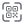
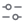

# ThePromptProtocol Design System

## 1. Brand Logo

- Brand name: ThePromptProtocol
- Mark: a graphic symbol combining a diagonal slash "/" and the letter "P" (reads as "/P"), set inside a circular color badge
- Wordmark structure: a small superscript "THE" above/beside the main "PromptProtocol" text
- Asset files:
  - **Full logo**: `assets/img-brand-logo/` — icon + wordmark combination, 4 color variants (main / black / white / green)
  - **Logomark**: `assets/img-brand-logomark/` — icon only, no text, same 4 color variants (main / black / white / green)

### 1.1 Color Variants

| Variant | Full Logo Preview | Logomark Preview | Circle Background | "P" Icon Color | "PromptProtocol" Color | "THE" Color |
|---|---|---|---|---|---|---|
| Light background |  |  | Gradient White → #E3E3E3 | Brand/100 #47EA81 | Brand/100 #47EA81 | Black #000000 |
| Black background |  |  | Black #000000 | Brand/100 #47EA81 | Black #000000 | Black #000000 |
| Icon-only (no visible background) |  |  | White #FFFFFF (invisible on a light canvas) | Brand/100 #47EA81 | Brand/100 #47EA81 | Black #000000 |
| Solid green background |  |  | Brand/100 #47EA81 | White #FFFFFF | Black #000000 | Black #000000 |

> Note: The Logomark (icon-only) file's 4 variants use the exact same background/icon color pairings as above, just without the wordmark.

### 1.2 Sizing
- Icon diameter: 24px (circular badge)
- Full logo (icon + wordmark) reference size: 134×24, with roughly 8–9px spacing between icon and text
- In the full logo, "THE" and the main "PromptProtocol" text are left-aligned to the right of the icon

## 2. Color System (Color Variables and Styles)

### 2.1 Brand Colors
| Name | Hex |
|---|---|
| Brand/100 | #47EA81 |
| Brand/120 | #39BB67 |
| Brand/80 | #6CEE9A |
| Brand/70 | #7EF0A7 |
| Brand/50 | #A3F5C0 |
| Brand/30 | #C8F9D9 |
| Brand/20 | #DAFBE6 |
| Brand/10 | #EDFDF2 |

### 2.2 Secondary Colors
| Name | Hex |
|---|---|
| Secondary/100 | #979FFD |
| Secondary/120 | #797FCA |
| Secondary/80 | #ACB2FD |
| Secondary/70 | #B6BCFE |
| Secondary/50 | #CBCFFE |
| Secondary/30 | #E0E2FE |
| Secondary/20 | #EAECFF |
| Secondary/10 | #F5F5FF |

### 2.3 Neutral Colors
| Name | Hex |
|---|---|
| Black | #000000 |
| Neutral/90 | #242733 |
| Neutral/80 | #3A3E4C |
| Neutral/70 | #606064 |
| Neutral/60 | #6F7075 |
| Neutral/50 | #85878A |
| Neutral/40 | #A9A9A9 |
| Neutral/30 | #C3C3C3 |
| Neutral/20 | #DBDBDB |
| Neutral/10 | #F0F0F0 |
| White | #FFFFFF |

### 2.4 Gradient Colors
- Gradient/Green-Blue
- Gradient/Orange-Yellow
- Gradient/Green-Pink

## 3. Typography (Montserrat)

Font family: **Montserrat**

### 3.1 Titles
| Style | Size | Line Height | Weight |
|---|---|---|---|
| Title 42 Bold | 42px | 58px | Bold |
| Title 32 Bold | 32px | 40px | Bold |
| Title 24 Bold | 24px | 36px | Bold |
| Title 24 Medium | 24px | 36px | Medium |

### 3.2 Subtitles
| Style | Size | Line Height | Weight |
|---|---|---|---|
| Subtitle 20 Bold | 20px | 24px | Bold |
| Subtitle 20 Medium | 20px | 24px | Medium |
| Subtitle 18 Bold | 18px | 22px | Bold |
| Subtitle 18 Semi Bold | 18px | 22px | Semibold |
| Subtitle 18 Medium | 18px | 22px | Medium |
| Subtitle 18 Regular | 18px | 22px | Regular |
| Subtitle 16 Semi Bold | 16px | 20px | Semibold |

### 3.3 Body
| Style | Size | Line Height | Weight |
|---|---|---|---|
| Body 16 Medium | 16px | 24px | Medium |
| Body 16 Regular | 16px | 24px | Regular |
| Body 14 Medium | 14px | 22px | Medium |
| Body 14 Regular | 14px | 22px | Regular |
| Body 13 Medium | 13px | 18px | Medium |
| Body 13 Regular | 13px | 18px | Regular |

### 3.4 Captions
| Style | Size | Line Height | Weight |
|---|---|---|---|
| Caption 12 Medium | 12px | 20px | Semi Bold |
| Caption 12 Regular | 12px | 20px | Regular |

### 3.5 Action (Button/Link Text)
| Style | Size | Line Height | Weight |
|---|---|---|---|
| Button 14 | 14px | 18px | Medium |
| Link 14 | 14px | 18px | Semibold |
| Button 12 | 12px | 16px | Medium |
| Button 10 | 10px | 13px | Regular |

## 4. Icons

### 4.1 Base icons-Line
Linear-style base icon library for navigation, actions, arrows, and other general-purpose uses. 130 icons total:

| | | | | | | | |
|---|---|---|---|---|---|---|---|
|  |  |  |  |  |  |  |  |
| AddCircle-1 | AddCircle | Add_Tags | Back | Brand | Calendar | Camera-1 | Camera |
|  |  |  |  |  |  |  |  |
| Card | Categories | Chart-pie | Chart | Check | CheckCircle | Clock | CloseCircle-1 |
|  |  |  |  |  |  |  |  |
| CloseCircle | Contact | ContactWithUS | Copy | Delete | Discount | Dislike | Down |
|  |  |  |  |  |  |  |  |
| DownFill | DownLine | DownkCircle | Downlosd | Edit | Edit_Complete | Email | ErrorCircle |
|  |  |  |  |  |  |  |  |
| Expand | Explore | Eye-1 | Eye | Feedback | Filter | FingerPrint | GPS |
|  |  |  |  |  |  |  |  |
| Global | Hand | Home | Inbox | InfoCircle | LanguageSwitching | Left | LeftCircle |
|  |  |  |  |  |  |  |  |
| LeftLine | Like | Link | Loading | Location-1 | Location | Lock | Love |
|  |  |  |  |  |  |  |  |
| Mark | Marketplace | Menu | MenuDraw | MenuPush | Message | Microphone-slash | Microphone |
|  |  |  |  |  |  |  |  |
| Mobile | More | MoreCircle-1 | MoreCircle | Mute | Notification | Package | Picture |
|  |  |  |  |  |  |  |  |
| PlayCircle | PoliceTerm | Profile | QR | Quantity | QuestionCircle | Record | Recovery |
|  |  |  |  |  |  |  |  |
| Reffer | Refresh-circle | Reminder | Right | RightCircle | RightLine | Rotate | Ruler |
|  |  |  |  |  |  |  |  |
| Save | Scan | Scan_QR | Search | Send | Setting | Share-1 | Share |
|  |  |  |  |  |  |  |  |
| Shield | SignIn | SignOut | Sliders | Sound | Star | Tag | Theme |
|  |  |  |  |  |  |  |  |
| Ticket | Timer | Types | Unlock-1 | Unlock | Up | UpCircle | UpFill |
|  |  |  |  |  |  |  |  |
| UpLine | User-1 | User-2 | User | UserAdd | UserSwitch | Video-slash | Video |
|  |  |  |  |  |  |  |  |
| Zoom_In | Zoom_Out | data-1 | data | list | minimizeCircle-1 | minimizeCircle | note |
|  |  | | | | | | |
| receipt | wallet-3 | | | | | | |

### 4.2 Icon-Menu
Colored icons for menu/navigation. 7 icons total:

| | | | | | |
|---|---|---|---|---|---|
|  |  |  |  |  |  |
| DashboardAllData | dashboardMyProfile | dashboardMyRewards | dataContribution | dataNetworkTiers | myConnections |
|  | | | | | |
| myRewards | | | | | |

### 4.3 Icon-Tasks
Task-related icons. 10 icons total:

| | | | | | |
|---|---|---|---|---|---|
|  |  |  |  |  |  |
| AI_Robot_Chat | Branded_Surveys | HITL_Validation | KYC | MBTI | Profile_Surveys |
|  |  |  |  | | |
| Trivia | Video_Quiz | Wheel | Worded | | |

### 4.4 Icons-Assets
Colored icons for assets/resources. 3 icons total:

| | | | | | |
|---|---|---|---|---|---|
|  |  |  | | | |
| Credit | PTC | PTC_Credit | | | |

## 5. Buttons

4 sizes total: Small / Medium / Large / Text, each available in fill and line (outline) styles, with default / hover / pressed / disabled states.

| Size | Container Size (example) | Padding (H/V) | Corner Radius | Font Size |
|---|---|---|---|---|
| Button Small | 82×30px | 16 / 8 | 30 (pill) | 14px |
| Button Medium | 105×40px | 24 / 12 | 40 (pill) | 16px |
| Button Large | 135×52px | 32 / 16 | 52 (pill) | — |
| Button Text | content-adaptive | 20 / 4 | 0 (no background) | 14px |

**State colors (using fill style as example):**
| State | Fill Color | Text Color |
|---|---|---|
| Default | Brand/100 | Black |
| Hover | Brand/70 | Black |
| Pressed | Brand/120 | Black |
| Disabled | Neutral/20 | Neutral/50 |

**Line (outline) style**: no fill, Brand/100 stroke color, 1px stroke width (inside alignment).

## 6. Spacing System (4pt Grid)

Uses a 4pt grid spacing system with the following base spacing scale:
```
2, 4, 6, 8, 10, 12, 16, 20, 24, 28, 32, 36 (px)
```

## 7. Shadows and Blur Styles

Shadows are organized into 3 intensity levels × 4 sizes, for 12 total styles:
- Intensity: subtle / regular / strong
- Size: sm / md / lg / xl

Example (regular md): `X:0 Y:2.96 Blur:5.93 Spread:0 Color:#000000 10%`. The actual effect is composed of 3 stacked drop shadows plus 1 background blur layer, creating a layered light-to-dark depth effect.

## 8. Brand Mascot / IP Character

The brand has its own cartoon IP character (a green "P"-shaped mascot), including:

### 8.1 Base


Base design: a green "P"-shaped body with simple black-and-white oval eyes, no additional expression or accessories.

