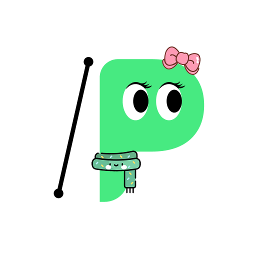
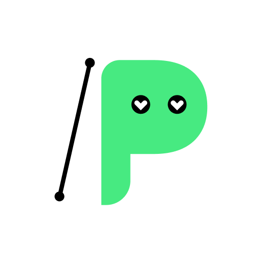
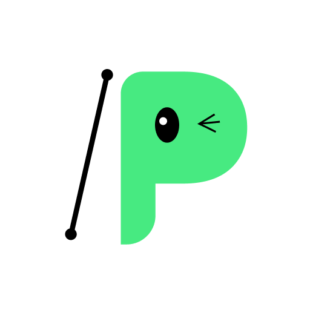
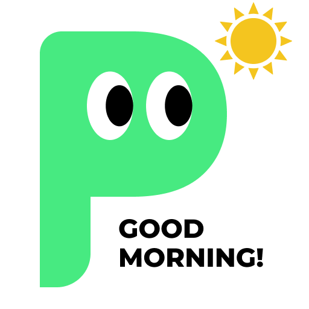
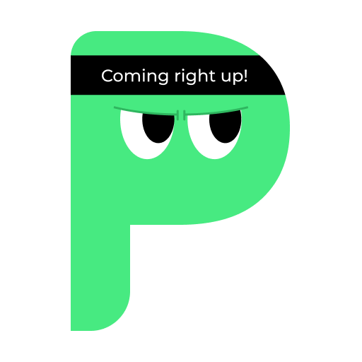
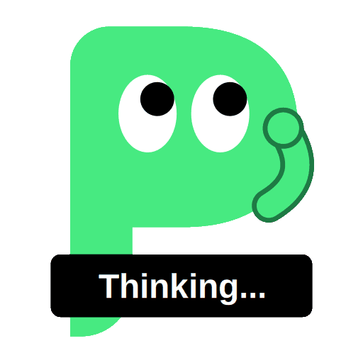


# ThePromptProtocol 社媒素材库

本文档收录可直接用于 Twitter / Instagram / Telegram 的成品素材，按素材类型分类，并附平台图片尺寸规范供制作时参考。

> 素材文件与本文档保持相对路径引用，请勿单独移动图片文件。
>
> 色彩、字体、Logo用法等基础设计规则见 [`design-system-cn.md`](../design-system-cn.md)，本文档只收录可直接发布的成品素材。

---

# 平台图片尺寸规范

> 渠道：Twitter / X · Instagram · Telegram

## Twitter / X

| 类型 | 推荐尺寸 | 比例 | 说明 |
|---|---|---|---|
| 头像 Profile Photo | 400×400px | 1:1 | 显示为圆形，重要内容居中放置以避免边缘裁切 |
| 头图 Header/Banner | 1500×500px | 3:1 | 移动端会裁切两侧，核心内容放在中间安全区 |
| 单图信息流 · 横版 | 1200×675px | 16:9 | 最常用，信息流展示效果最佳 |
| 单图信息流 · 方图 | 1200×1200px | 1:1 | 适合产品截图/引言类 |
| 单图信息流 · 竖版 | 1080×1350px | 4:5 | 竖版在移动端占屏更大，适合强视觉内容 |
| 多图（2-4张） | 各1200×1200px | 1:1 | 建议统一比例，避免拼贴时高度不齐 |

**文件建议**：静态图 JPG/PNG，控制在 5MB 以内；GIF 动图不超过 15MB。

## Instagram

| 类型 | 推荐尺寸 | 比例 | 说明 |
|---|---|---|---|
| 头像 Profile Photo | 320×320px | 1:1 | 显示为圆形，实际展示约110×110，细节不要太密集 |
| Feed 单图 · 方图 | 1080×1080px | 1:1 | 经典标准格式 |
| Feed 单图 · 竖版 | 1080×1350px | 4:5 | **官方推荐**，在信息流中占屏面积最大，优先使用 |
| Feed 单图 · 横版 | 1080×566px | 1.91:1 | 不建议常用，占屏面积最小 |
| 轮播 Carousel | 同 Feed 尺寸，统一比例 | 1:1 或 4:5 | 多图务必统一比例，滑动时不跳动 |
| Stories / Reels 封面 | 1080×1920px | 9:16 | 顶部预留约250px、底部预留约250px的UI安全区，避免文字被遮挡 |

**文件建议**：JPG/PNG，单文件不超过30MB；文字类内容尽量避免贴近四周边缘。

## Telegram

| 类型 | 推荐尺寸 | 比例 | 说明 |
|---|---|---|---|
| 头像 Profile Photo（用户/频道/群组） | 512×512px | 1:1 | 支持更小尺寸，但512×512兼容性最好 |
| 频道封面图（Channel Photo） | 512×512px | 1:1 | 同头像规格 |
| 帖子配图 | 1280×720px | 16:9 | Telegram 不强制裁切比例，但超宽/超高图在预览中会被压缩变形，建议贴近16:9或1:1 |
| 帖子配图 · 方图 | 1080×1080px | 1:1 | 适合与 Instagram 素材复用 |
| 相册/多图 | 与帖子配图一致 | 16:9 或 1:1 | 建议同一相册内比例统一 |

**文件建议**：作为"照片"发送会被压缩（长边建议不超过1280px，压缩更自然）；如需保留原始画质，可用"文件"方式发送，但不会显示预览图。

## 三渠道通用尺寸建议

| 通用格式 | 尺寸 | 覆盖渠道 |
|---|---|---|
| 方图 | 1080×1080px | Instagram Feed、Telegram、Twitter（均可直接使用） |
| 竖版 | 1080×1350px | Instagram Feed（推荐）；可裁切给 Twitter 竖版 |
| 横版 | 1200×675px | Twitter（推荐）；裁切后可用于 Telegram |
| 竖屏全屏 | 1080×1920px | Instagram/Telegram Stories 专用 |

**制作技巧**：按最大尺寸（1080×1920 或 1080×1350）设计主视觉，核心内容（文字、Logo、CTA）放在居中安全区内，再向下裁切适配到其他平台，比每个平台单独设计更高效。

*以上规格基于截至 2026年1月 的平台公开信息整理，各平台可能不定期调整规格与压缩策略，正式批量投放前建议在对应平台官方帮助中心复核最新数值。*

---

# 素材分类

## 一、Avatar 头像

品牌吉祥物的头像换装变体，共18款，可用于社群账号头像、社区身份徽章等场景。

| 默认 | 冬季毛帽+围巾 | 蓝色棒球帽 | 橙色棒球帽 | 遮阳帽 | 牛仔帽 |
|---|---|---|---|---|---|
|  |  |  |  |  |  |

| 蓝绿条纹围巾 | 睫毛款(默认) | 阔边帽+粉色围巾 | 蝴蝶结+围巾 | 睫毛款+红围巾 | 生气 |
|---|---|---|---|---|---|
|  |  |  |  |  |  |

| 害羞/眩晕 | 可爱(眯眼笑) | 怀疑 | 爱心眼 | 困倦 | 侧看/眨眼 |
|---|---|---|---|---|---|
|  |  |  |  |  |  |

---

## 二、Emojis 表情包

官方吉祥物表情包，用于评论区互动、Telegram群聊回复、快捷回应。

| 表情 | 预览 | 适用场景 |
|---|---|---|
| Good Morning |  | 每日问候、开盘播报 |
| Heart |  | 感谢、庆祝类回复 |
| Like |  | 认可、点赞类回复 |
| Nice |  | 称赞、达成目标 |
| Coming Right Up |  | 回应"即将上线/马上处理" |
| LFG |  | 兴奋、造势、活动预热 |
| Mind Blown |  | 惊喜、意外好消息 |
| Wave |  | 打招呼、欢迎新成员 |
| GG! |  | 庆祝达成目标、活动结束播报 |
| Thinking... |  | 提问、征集意见、悬念预告 |
| Syncing... |  | 加载中、数据同步中、维护公告 |

---

## 三、IP插画

*暂无内容，待后续产出后补充。*

---

## 四、社媒媒体图

*本分类内容正在修改中，暂缓收录，待定稿后更新。*

---
